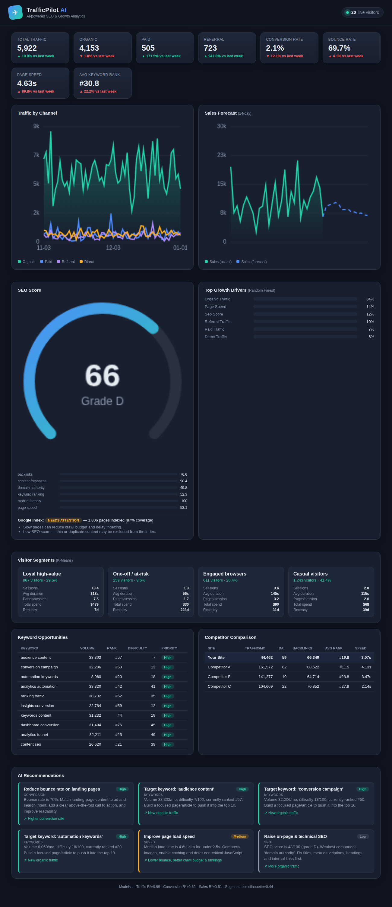

# TrafficPilot AI ✈

**AI-powered SEO & Growth Analytics Platform.**

TrafficPilot AI analyses website traffic, SEO health and visitor behaviour to
**predict conversions and sales**, and produces **prioritised, actionable growth
recommendations** — which pages to improve, what content to write and which
keywords to target.

> বাংলায়: TrafficPilot AI একটি AI-চালিত SEO ও গ্রোথ অ্যানালিটিক্স প্ল্যাটফর্ম।
> এটি ওয়েবসাইটের ট্রাফিক, SEO এবং ভিজিটর আচরণ বিশ্লেষণ করে কনভার্সন ও বিক্রির
> পূর্বাভাস দেয় এবং কী পরিবর্তন করলে সার্চে ভালো র‍্যাঙ্ক, বেশি অর্গানিক ট্রাফিক ও
> বেশি বিক্রি পাওয়া যেতে পারে তার সুপারিশ দেয়।

---

## Machine learning at the core

| Algorithm         | Used for                                                        |
| ----------------- | --------------------------------------------------------------- |
| **XGBoost**       | Traffic, bounce-rate, conversion-rate and **sales prediction**  |
| **Random Forest** | Which factors influence growth the most (feature importance)    |
| **K-Means**       | Visitor **segmentation** into behavioural groups                |

## Features

- 📈 **Website Traffic Analysis** — organic / paid / referral / direct channels
- 🔍 **SEO Score Analysis** — weighted component breakdown + letter grade
- 🌐 **Google Index Status Check** — coverage estimate + crawl-health warnings
- 🎯 **Keyword Opportunity Analysis** — striking-distance keyword scoring
- 👥 **Visitor Behaviour Analysis** — K-Means behavioural segments
- ↩️ **Bounce Rate Prediction**
- 💱 **Conversion Rate Prediction**
- 💰 **Sales Prediction & 14-day Forecast**
- 🏁 **Competitor Comparison**
- 🤖 **AI Recommendations** — prioritised, with expected impact

### Dashboard

Live visitors · Organic / Paid / Referral traffic · Keyword ranking · Page speed
· Conversion rate · **Sales forecast** — all in one dark, responsive dashboard.



---

## Project layout

```
trafficpilot/
├── config.py              # paths, feature/target definitions, constants
├── data/generator.py      # synthetic-but-realistic datasets
├── models/
│   ├── traffic_model.py   # XGBoost multi-target predictor
│   ├── importance.py      # Random-Forest driver analysis
│   └── segmentation.py    # K-Means visitor segmenter
├── analysis/
│   ├── seo.py             # SEO score, index status, keywords, competitors
│   └── recommendations.py # AI recommendation engine
├── service.py             # assembles the full dashboard payload
├── train.py               # trains + saves every model
└── web/                   # Flask dashboard (app + templates + static)
scripts/run_demo.py        # end-to-end text demo (no web server)
tests/                     # pytest suite
```

Because there is no live analytics connection, TrafficPilot ships with a
**synthetic data generator** whose signals follow believable business
relationships (better SEO/backlinks → more traffic; faster pages → lower bounce;
lower bounce → more conversions; sales = traffic × conversion × order value), so
the models learn something meaningful. Swap `trafficpilot/data/generator.py` for
a real Google Analytics / Search Console connector to go live.

---

## Quick start

```bash
# 1. install
pip install -r requirements.txt

# 2. train the models (saves artifacts to ./artifacts)
python -m trafficpilot.train

# 3a. run the text demo
python scripts/run_demo.py

# 3b. …or launch the dashboard
python -m trafficpilot.web.app
#   -> open http://127.0.0.1:5000
```

Training is optional — the web app and demo will **train on first run** if no
saved artifacts are found.

### HTTP API

| Endpoint                | Description                        |
| ----------------------- | ---------------------------------- |
| `GET /`                 | Dashboard (HTML)                   |
| `GET /api/dashboard`    | Full analytics payload (JSON)      |
| `GET /api/recommendations` | Recommendations only (JSON)     |
| `GET /api/health`       | Liveness probe                     |

---

## Using the models directly

```python
from trafficpilot.data import generate_site_metrics
from trafficpilot.models import TrafficPredictor, FeatureImportanceAnalyzer

df = generate_site_metrics()

# forecast every KPI
predictor = TrafficPredictor().fit(df)
print(predictor.metrics)                 # R² / MAE per target
print(predictor.forecast_next(df, 14))   # 14-day forecast

# what drives sales?
analyzer = FeatureImportanceAnalyzer(target="sales").fit(df)
print(analyzer.top_drivers(5))
```

## Tests

```bash
python -m pytest tests/ -q
```

---

## Tech stack

Python · XGBoost · scikit-learn · pandas / NumPy · Flask · vanilla-JS canvas
charts (no front-end build step, no external CDN).

## License

See [LICENSE](LICENSE).
